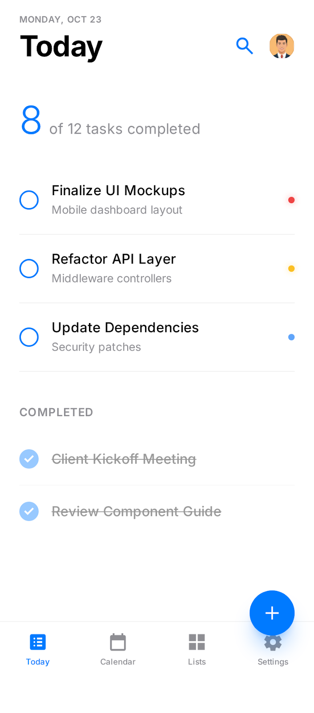
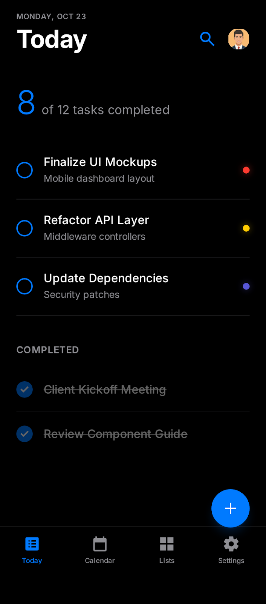
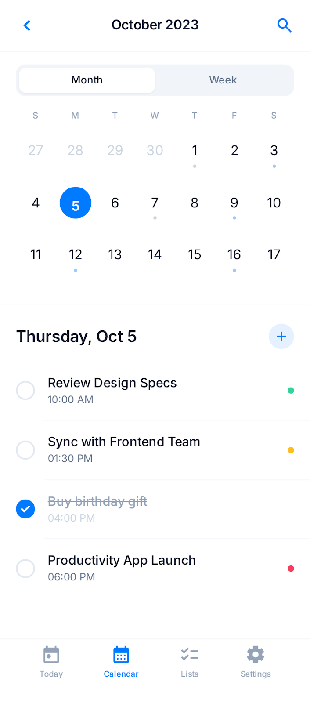
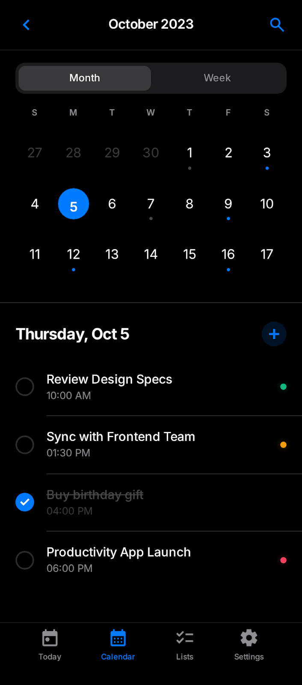
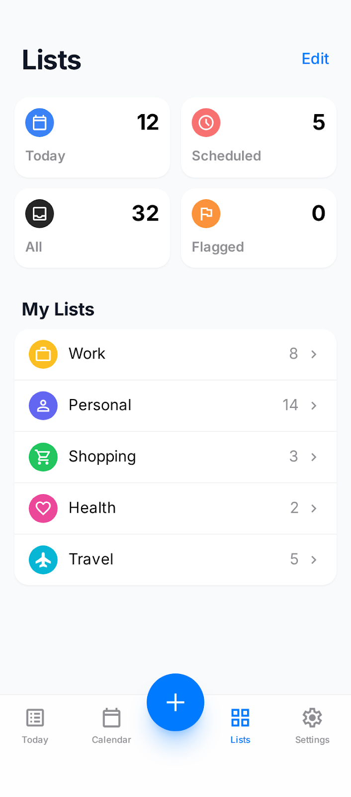
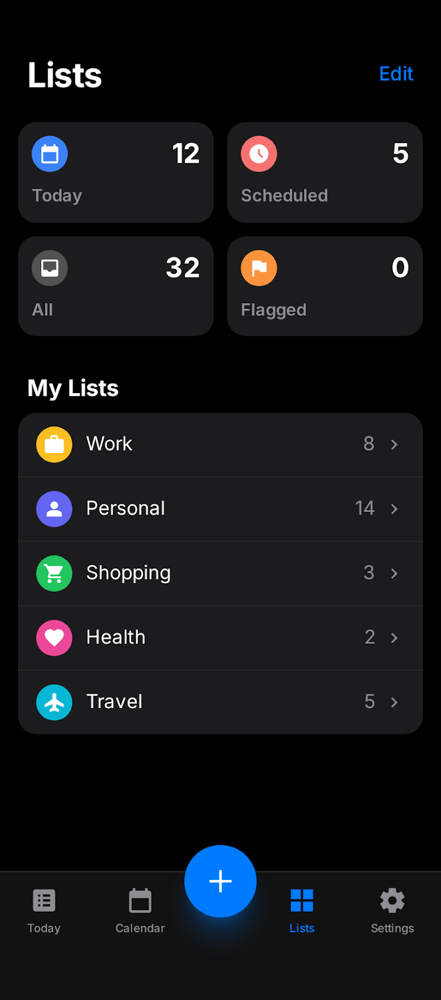
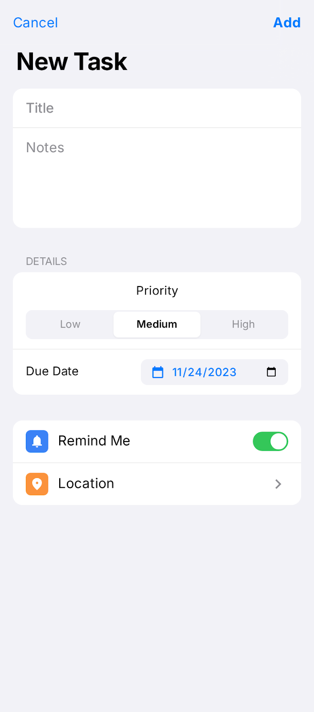
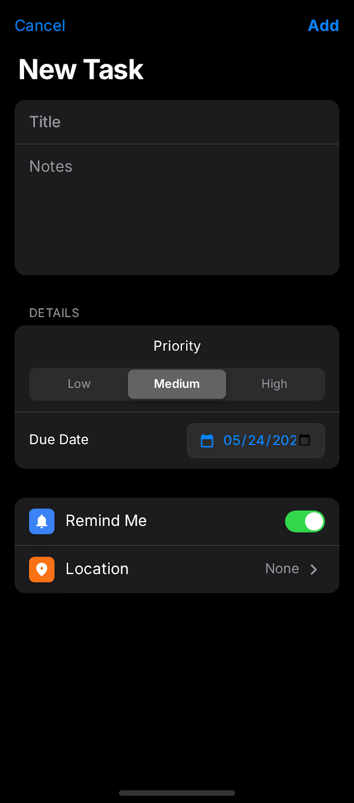

# ✓ To do List

A task manager for Android and Windows, built with Flutter and Dart. Tasks live
in a local SQLite database — no account, no network.

The interface follows an iOS-inspired design: large titles, grouped cards,
a translucent bottom bar, and full light and dark themes.

## 📱 Screens

### Today

The day's work: what is due today, what is overdue, and anything still
unscheduled. Swipe a task left to delete it, right to flag it.

| Light | Dark |
| --- | --- |
|  |  |

### Calendar

Month or week view, with a coloured dot under every day that has tasks. Tapping
a day shows its tasks with their times.

| Light | Dark |
| --- | --- |
|  |  |

### Lists

Smart shortcuts — Today, Scheduled, All, Flagged — over the user's own lists.
*Edit* hides or shows a list, and the choice is remembered.

| Light | Dark |
| --- | --- |
|  |  |

### New task

The same sheet creates and edits. Priority, due date, time, list, flag,
reminder and location.

| Light | Dark |
| --- | --- |
|  |  |

## ✨ Features

- Create, edit, complete and delete tasks, with undo on delete
- Three priority levels, shown as a coloured dot
- Due date and optional time
- Five lists: Work, Personal, Shopping, Health, Travel
- Flag a task to pin it to the Flagged shortcut
- Local reminders scheduled for the task's due time
- Search across title, notes, list and location
- Light and dark themes, following the system or set by hand — the choice persists
- Everything stored locally in SQLite

## 🗺 Project architecture

Layered, with the dependency arrow always pointing inwards:
`data` → `domain` → `presentation`.

Inside `presentation` the split is MVC-like: a **view** holds only the screen's
widgets, and its **controller** holds everything else — state, initialization,
and the functions that return data.

```
lib
├── main.dart                      # composition root: wires services and controllers
└── src
    ├── config/themes
    │   ├── app_colors.dart        # AppPalette + AppColors (ThemeExtension)
    │   └── app_theme.dart
    ├── data
    │   ├── providers              # SQLite access and schema migrations
    │   ├── repositories           # connects use cases to the providers
    │   └── services               # notifications, shared preferences
    ├── domain
    │   ├── model                  # TaskModel, TaskCategory
    │   └── useCases               # get, add, update, delete
    ├── presentation
    │   ├── app.dart
    │   ├── controller             # one per screen, plus task and theme
    │   ├── view                   # one per screen: widgets only
    │   └── widgets                # shared components
    └── utils
        ├── constants              # every UI string, behind an interface
        └── extensions             # task filters, priority labels and colours
```

A few conventions worth knowing before changing the code:

- **State** is `ValueNotifier` + `ValueListenableBuilder`. No external state
  management package.
- **Controllers** expose `ValueListenable`, never the raw notifier, and know
  nothing about widgets. Anything needing a `BuildContext` — opening a picker,
  a sheet or a snackbar — stays in the view.
- **Colours** never appear as literals in widgets. They come from `AppPalette`
  for the fixed ones, or `context.colors` for the ones that change with the theme.
- **Strings** live in `app_strings.dart` behind the `AppStrings` interface.
  Adding a language means writing one class and swapping one line; no screen
  changes.
- **Comments** on the data and domain layers are bilingual: Portuguese first,
  English second.

## ⚙ Prerequisites and how to run

- Flutter 3.41 or newer
- Dart 3.11 or newer

```bash
git clone https://github.com/<user>/To-do-list.git
cd To-do-list/to_do_list
flutter pub get
flutter run
```

On Windows and Linux the database runs through `sqflite_common_ffi`, which
`main.dart` sets up automatically.

### Tests

```bash
flutter test
```

Covers the model and its serialization, the task filters, and the calendar,
editor and task controllers.

## 📌 Notes

The images above are the design mockups the screens were built from, kept in
`to_do_list/docs/screenshots/`.

This project is still evolving and there is room to improve it.
